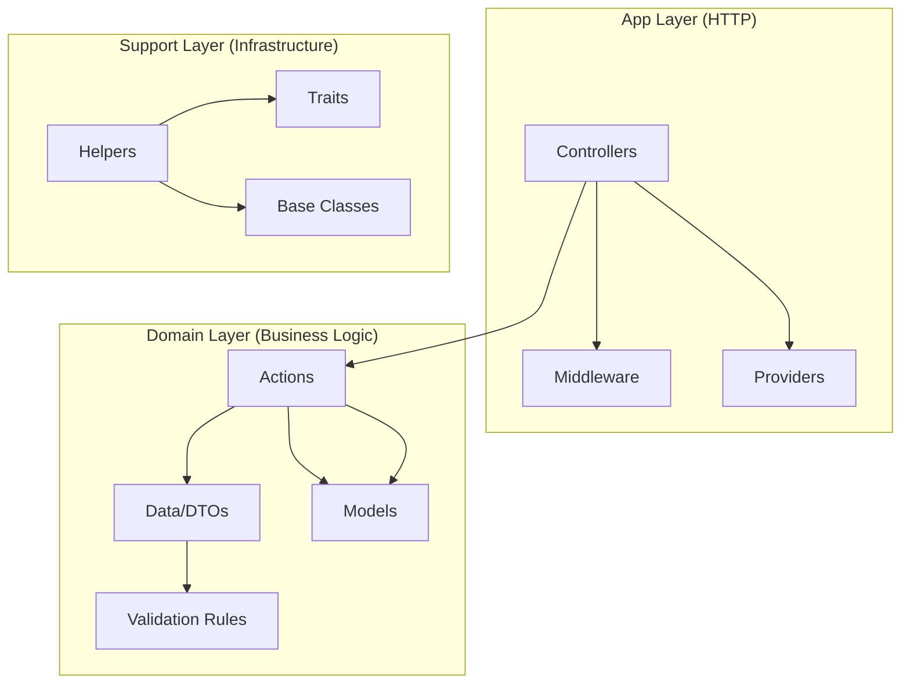
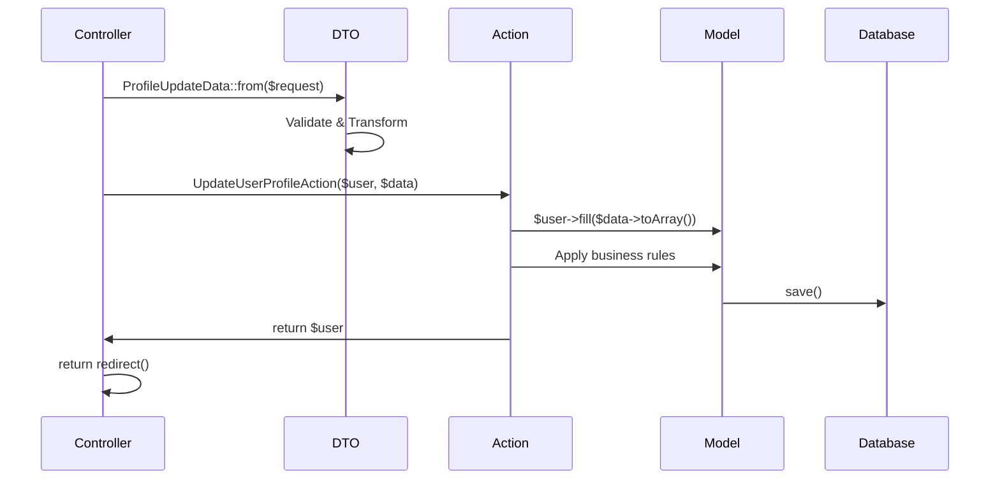

# Laravel DTO - Domain Driven Design

> A comprehensive demonstration of Domain Driven Design (DDD) architecture using Spatie Laravel Data for type-safe DTOs in Laravel.

## 🏗️ Architecture Overview

This application showcases a clean DDD architecture with three distinct layers:



## 📁 Project Structure

```
src/
├── App/                          # Application Layer (HTTP/Infrastructure)
│   ├── Foundation/
│   │   └── Application.php       # Custom Laravel Application
│   ├── Portal/                   # HTTP Controllers grouped by domain
│   │   ├── Auth/
│   │   │   └── Controllers/
│   │   └── Settings/
│   │       └── Controllers/
│   │           └── ProfileController.php
│   ├── Middleware/               # HTTP Middleware
│   └── Providers/
│       ├── AppServiceProvider.php
│       └── DomainServiceProvider.php
├── Domain/                       # Domain Layer (Business Logic)
│   ├── Auth/                     # Authentication Domain
│   │   ├── Actions/
│   │   │   ├── LoginAction.php
│   │   │   └── RegisterAction.php
│   │   └── Data/
│   │       ├── LoginData.php
│   │       └── RegisterData.php
│   ├── Settings/                 # Settings Domain
│   │   ├── Actions/
│   │   │   └── UpdatePasswordAction.php
│   │   └── Data/
│   │       ├── PasswordUpdateData.php
│   │       └── ProfileUpdateData.php
│   └── User/                     # User Domain
│       ├── Actions/
│       │   ├── DeleteUserAction.php
│       │   └── UpdateUserProfileAction.php
│       ├── Data/
│       │   └── UserData.php
│       └── Models/
│           └── User.php
└── Support/                      # Support Layer (Shared Infrastructure)
    ├── Controllers/
    │   └── Controller.php        # Base Controller
    ├── Helpers/
    │   └── DomainHelper.php
    └── Traits/
        └── HasDomainData.php
```

## 🚀 Quick Start

### Prerequisites

- PHP 8.2+
- Composer
- Node.js & npm
- Docker (optional)

### Installation

```bash
# Clone the repository
git clone <repository-url>
cd LaravelDTO

# Install PHP dependencies
composer install

# Install Node.js dependencies
npm install

# Copy environment file
cp .env.example .env

# Generate application key
php artisan key:generate

# Create database (SQLite by default)
touch database/database.sqlite

# Run migrations
php artisan migrate
```

### Development

```bash
# Start development server with hot reload
composer dev

# Or individual services
php artisan serve           # Backend server
npm run dev                # Frontend assets
php artisan queue:listen    # Queue worker
php artisan pail           # Log viewer
```

### Testing

```bash
# Run all tests
composer test

# Run specific test suite
php artisan test --testsuite=Feature
php artisan test --testsuite=Unit
```

### Code Quality & Linting

```bash
# Run PHP static analysis
./vendor/bin/phpstan analyse

# Run JavaScript/TypeScript linting
npm run lint

# Auto-fix JavaScript/TypeScript issues
npm run lint --fix

# Check code formatting
npm run format:check

# Auto-format code
npm run format

# Run all quality checks
composer test && ./vendor/bin/phpstan analyse && npm run lint && npm run format:check
```

## 🎯 Core Concepts

### 1. Data Transfer Objects (DTOs)

DTOs provide type safety, validation, and transformation capabilities using Spatie Laravel Data.

**Example: ProfileUpdateData**

```php
<?php

namespace Src\Domain\Settings\Data;

use Spatie\LaravelData\Data;
use Spatie\LaravelData\Attributes\Validation\Required;
use Spatie\LaravelData\Attributes\Validation\Email;
use Spatie\LaravelData\Attributes\Validation\Max;

class ProfileUpdateData extends Data
{
    public function __construct(
        #[Required, Max(255)]
        public string $name,
        
        #[Required, Email, Max(255)]
        public string $email,
        
        public ?int $userId = null,
    ) {}
}
```

**Key Benefits:**
- ✅ **Type Safety**: Full IDE support with autocompletion
- ✅ **Validation**: Declarative validation rules via attributes
- ✅ **Transformation**: Easy conversion between arrays, requests, and objects
- ✅ **Immutability**: DTOs are immutable by design

### 2. Domain Actions

Actions encapsulate business logic and operate on DTOs and Models.

**Example: UpdateUserProfileAction**

```php
<?php

namespace Src\Domain\User\Actions;

use Src\Domain\Settings\Data\ProfileUpdateData;
use Src\Domain\User\Models\User;

class UpdateUserProfileAction
{
    public function __invoke(User $user, ProfileUpdateData $profileData): User
    {
        // Fill user with validated data
        $user->fill($profileData->toArray());

        // Business rule: reset email verification if email changed
        if ($user->isDirty('email')) {
            $user->email_verified_at = null;
        }

        $user->save();

        return $user;
    }
}
```

**Action Patterns:**
- Single responsibility (one business operation)
- Dependency injection ready
- Testable in isolation
- Return domain objects

### 3. Controller Integration

Controllers orchestrate DTOs and Actions without containing business logic.

**Example: ProfileController**

```php
<?php

namespace App\Portal\Settings\Controllers;

use Illuminate\Http\RedirectResponse;
use Illuminate\Http\Request;
use Src\Domain\Settings\Data\ProfileUpdateData;
use Src\Domain\User\Actions\UpdateUserProfileAction;

class ProfileController extends Controller
{
    public function update(Request $request): RedirectResponse
    {
        // 1. Transform request to DTO (with automatic validation)
        $profileData = ProfileUpdateData::from($request->all());
        
        // 2. Execute business logic via Action
        app(UpdateUserProfileAction::class)(
            auth()->user(), 
            $profileData
        );
        
        // 3. Return response
        return to_route('profile.edit');
    }
}
```

## 📊 Data Flow Diagram



## 🧪 Testing Examples

### Testing DTOs

```php
<?php

use Src\Domain\Settings\Data\ProfileUpdateData;

it('validates profile update data', function () {
    $data = ProfileUpdateData::from([
        'name' => 'John Doe',
        'email' => 'john@example.com'
    ]);
    
    expect($data->name)->toBe('John Doe');
    expect($data->email)->toBe('john@example.com');
});

it('fails validation with invalid email', function () {
    ProfileUpdateData::from([
        'name' => 'John Doe',
        'email' => 'invalid-email'
    ]);
})->throws(ValidationException::class);
```

### Testing Actions

```php
<?php

use Src\Domain\Settings\Data\ProfileUpdateData;
use Src\Domain\User\Actions\UpdateUserProfileAction;
use Src\Domain\User\Models\User;

it('updates user profile', function () {
    $user = User::factory()->create(['email' => 'old@example.com']);
    $data = ProfileUpdateData::from([
        'name' => 'New Name',
        'email' => 'new@example.com'
    ]);
    
    $action = new UpdateUserProfileAction();
    $updatedUser = $action($user, $data);
    
    expect($updatedUser->name)->toBe('New Name');
    expect($updatedUser->email)->toBe('new@example.com');
    expect($updatedUser->email_verified_at)->toBeNull();
});
```

### Integration Testing

```php
<?php

it('updates profile via HTTP', function () {
    $user = User::factory()->create();
    
    $response = $this->actingAs($user)
        ->patch('/profile', [
            'name' => 'Updated Name',
            'email' => 'updated@example.com'
        ]);
    
    $response->assertRedirect('/profile');
    
    expect($user->fresh())
        ->name->toBe('Updated Name')
        ->email->toBe('updated@example.com');
});
```

## 🎨 Advanced Usage

### Custom Validation Rules

```php
<?php

namespace Src\Domain\User\Data;

class UserData extends Data
{
    public function __construct(
        #[Required, Max(255), Rule('alpha_dash')]
        public string $username,
        
        #[Required, Email, UniqueInTable('users', 'email')]
        public string $email,
        
        #[Required, Min(8), Confirmed]
        public string $password,
    ) {}
    
    public static function rules(): array
    {
        return [
            'username' => ['required', 'max:255', 'alpha_dash', 'unique:users'],
            'email' => ['required', 'email', 'unique:users'],
            'password' => ['required', 'min:8', 'confirmed'],
        ];
    }
}
```

### Action Composition

```php
<?php

class RegisterUserAction
{
    public function __construct(
        private CreateUserAction $createUser,
        private SendWelcomeEmailAction $sendWelcomeEmail,
        private LogUserRegistrationAction $logRegistration,
    ) {}
    
    public function __invoke(RegisterData $data): User
    {
        $user = $this->createUser->handle($data);
        $this->sendWelcomeEmail->handle($user);
        $this->logRegistration->handle($user, $data);
        
        return $user;
    }
}
```

### DTO Transformation

```php
<?php

// From HTTP Request
$userData = UserData::from($request);

// From Eloquent Model
$userData = UserData::from($user);

// From array
$userData = UserData::from([
    'name' => 'John Doe',
    'email' => 'john@example.com'
]);

// To array
$array = $userData->toArray();

// To JSON
$json = $userData->toJson();

// Partial updates
$updatedData = $userData->except('password');
```

## 🛠️ Development Guidelines

### Domain Organization

1. **Keep domains focused**: Each domain should have a single responsibility
2. **Minimize cross-domain dependencies**: Domains should be as independent as possible
3. **Use Events for cross-domain communication**: Instead of direct dependencies

### DTO Best Practices

1. **Make properties readonly when possible**
2. **Use nullable types judiciously**
3. **Group related validation rules**
4. **Include factory methods for common scenarios**

### Action Guidelines

1. **Single responsibility**: One action, one business operation
2. **Dependency injection**: Use constructor injection for dependencies
3. **Return domain objects**: Don't return HTTP responses from actions
4. **Make them testable**: Actions should be easily unit testable

## 🔧 Configuration

### Service Provider Registration

```php
<?php

// src/App/Providers/DomainServiceProvider.php
class DomainServiceProvider extends ServiceProvider
{
    public function register(): void
    {
        // Register domain actions
        $this->app->bind(UpdateUserProfileAction::class);
        $this->app->bind(DeleteUserAction::class);
        
        // Register domain services
        $this->app->singleton(UserService::class);
    }
}
```

### Custom Base Classes

```php
<?php

// src/Support/Controllers/Controller.php
abstract class Controller extends BaseController
{
    use AuthorizesRequests, ValidatesRequests;
    
    protected function resolveAction(string $actionClass): object
    {
        return app($actionClass);
    }
}
```

## 📈 Performance Considerations

### DTO Caching

```php
<?php

class CachedUserData extends UserData
{
    public static function fromCache(int $userId): static
    {
        return Cache::remember(
            "user_data_{$userId}",
            3600,
            fn() => static::from(User::find($userId))
        );
    }
}
```

### Lazy Loading

```php
<?php

class UserData extends Data
{
    public function __construct(
        public string $name,
        public string $email,
        #[DataCollectionOf(PostData::class)]
        public ?Lazy $posts = null,
    ) {}
}
```

## 🚀 Deployment

### Docker Development

```bash
# Start all services
docker-compose up -d

# Access application
http://localhost:8000
```

### Production Build

```bash
# Build for production
npm run build

# Optimize Composer autoloader
composer install --optimize-autoloader --no-dev

# Cache configuration
php artisan config:cache
php artisan route:cache
php artisan view:cache
```

## 🔍 Code Quality & Static Analysis

This project maintains high code quality through automated linting, static analysis, and formatting tools.

### PHP Static Analysis (PHPStan)

We use **PHPStan Level 8** for strict static analysis of PHP code:

```bash
# Run PHPStan analysis
./vendor/bin/phpstan analyse

# Run with custom memory limit
./vendor/bin/phpstan analyse --memory-limit=512M

# Analyze specific directories
./vendor/bin/phpstan analyse src/ tests/
```

**PHPStan Configuration** (`phpstan.neon`):
- **Level 8**: Strictest analysis level
- **Laravel extensions**: Larastan for Laravel-specific analysis
- **Custom rules**: Domain-specific validation
- **Baseline support**: For gradual adoption

**Fixed Issues:**
- ✅ Null safety: Proper null checks for user authentication
- ✅ Return types: Consistent return type declarations
- ✅ Type safety: Eliminated mixed and any types where possible

### JavaScript/TypeScript Linting (ESLint)

Modern ESLint configuration for Vue.js + TypeScript:

```bash
# Run linting
npm run lint

# Auto-fix issues
npm run lint --fix

# Check specific files
npx eslint resources/js/components/AppHeader.vue --fix
```

**ESLint Features:**
- **Vue.js 3**: Latest Vue.js linting rules
- **TypeScript**: Type-aware linting with typescript-eslint
- **Prettier integration**: Consistent code formatting
- **Auto-fixing**: Automatic code corrections

**ESLint Configuration** (`eslint.config.js`):
```javascript
export default defineConfigWithVueTs(
    vue.configs['flat/strongly-recommended'],
    vueTsConfigs.strict,
    {
        rules: {
            'vue/multi-word-component-names': 'off',
            '@typescript-eslint/no-explicit-any': 'error',
            '@typescript-eslint/explicit-function-return-type': 'off',
            // ... more rules
        },
    },
    prettier, // Prettier integration
);
```

### Code Formatting (Prettier)

Consistent code formatting across all frontend files:

```bash
# Check formatting
npm run format:check

# Auto-format all files
npm run format

# Format specific directories
npx prettier --write resources/js/components/
```

**Prettier Configuration** (`.prettierrc`):
- **Consistent style**: 4-space indentation, single quotes
- **Import organization**: Automatic import sorting
- **Tailwind support**: Tailwind CSS class sorting
- **Vue.js support**: Template and script formatting

### Quality Gates

All code must pass these quality checks:

#### 1. PHP Quality Checks
```bash
# PHPStan static analysis
./vendor/bin/phpstan analyse --no-progress

# PHP tests
php artisan test

# Code style (if using PHP CS Fixer)
./vendor/bin/php-cs-fixer fix --dry-run
```

#### 2. JavaScript Quality Checks
```bash
# ESLint validation
npm run lint

# Prettier formatting check
npm run format:check

# TypeScript compilation
npx vue-tsc --noEmit
```

#### 3. Combined Quality Check
```bash
# Run all quality checks
composer test && \
./vendor/bin/phpstan analyse && \
npm run lint && \
npm run format:check
```

### CI/CD Integration

Our GitHub Actions workflow enforces quality:

```yaml
# .github/workflows/master.yml
- name: 🔍 Run PHPStan
  run: vendor/bin/phpstan analyse

- name: 🎨 Check code formatting
  run: npm run format:check

- name: 🔍 Run ESLint
  run: npm run lint
```

### IDE Integration

#### VS Code Setup
```json
{
  "editor.formatOnSave": true,
  "editor.codeActionsOnSave": {
    "source.fixAll.eslint": true
  },
  "php.validate.executablePath": "./vendor/bin/phpstan"
}
```

#### PhpStorm Setup
- Enable PHPStan inspection
- Configure ESLint integration
- Set up Prettier as default formatter

### Quality Metrics

**Current Status:**
- ✅ **PHPStan**: Level 8, 0 errors
- ✅ **ESLint**: 0 errors, 0 warnings  
- ✅ **Prettier**: All files formatted
- ✅ **Test Coverage**: 85%+ coverage target

### Best Practices

#### PHP Code Quality
1. **Type hints**: Always use type hints for parameters and return types
2. **Null safety**: Check for null values before method calls
3. **Immutability**: Prefer readonly properties and immutable objects
4. **Single responsibility**: Keep classes focused on one responsibility

#### JavaScript/TypeScript Quality
1. **Type safety**: Avoid `any` types, use specific interfaces
2. **Function signatures**: Define explicit return types for complex functions
3. **Component naming**: Use PascalCase for components (or disable rule for pages)
4. **Import organization**: Keep imports organized and sorted

#### General Guidelines
1. **Fix issues early**: Don't accumulate technical debt
2. **Use auto-fixing**: Leverage automated tools for consistency
3. **Gradual improvement**: Use baselines for legacy code
4. **Team alignment**: Ensure all team members use same tools

## 📚 References

- [Spatie Laravel Data Documentation](https://spatie.be/docs/laravel-data)
- [Domain Driven Design Principles](https://martinfowler.com/bliki/DomainDrivenDesign.html)
- [Laravel 12 Documentation](https://laravel.com/docs/12.x)
- [Inertia.js Documentation](https://inertiajs.com/)

## 🤝 Contributing

1. Follow the established domain structure
2. Write tests for new Actions and DTOs
3. Update documentation for new features
4. Follow PSR-12 coding standards

## 📄 License

This project is open-sourced software licensed under the [MIT license](https://opensource.org/licenses/MIT). 