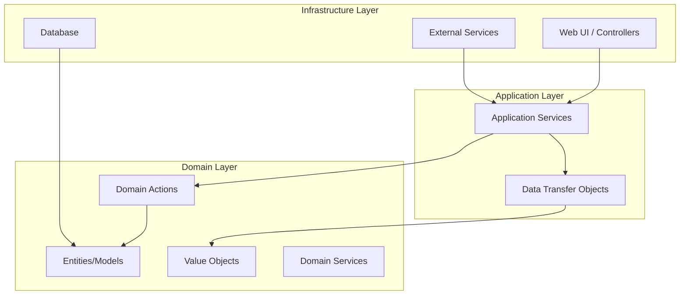

# Architecture Documentation

## Overview

This Laravel application implements Domain Driven Design (DDD) principles with a focus on clean architecture, type safety through DTOs, and maintainable business logic through Actions.

## Core Principles

### 1. Domain Driven Design (DDD)

The application is organized around business domains rather than technical layers:

- **Domain Logic First**: Business rules and logic are centralized in the domain layer
- **Ubiquitous Language**: Code uses the same terminology as business stakeholders
- **Bounded Contexts**: Each domain has clear boundaries and responsibilities

### 2. Clean Architecture



### 3. Dependency Direction

Dependencies flow inward:
- **Infrastructure → Application → Domain**
- Domain layer has no dependencies on outer layers
- Application layer depends on domain abstractions
- Infrastructure implements application interfaces

## Layer Responsibilities

### Domain Layer (`src/Domain/`)

The heart of the application containing:

- **Models**: Eloquent models representing domain entities
- **Actions**: Single-purpose classes containing business logic
- **Data**: DTOs for type-safe data transfer and validation
- **Value Objects**: Immutable objects representing domain concepts
- **Domain Services**: Complex business logic that doesn't belong to a single entity

#### Domain Structure Example

```
src/Domain/User/
├── Actions/
│   ├── CreateUserAction.php      # User creation business logic
│   ├── UpdateUserProfileAction.php
│   └── DeleteUserAction.php
├── Data/
│   ├── UserData.php              # User DTO with validation
│   ├── CreateUserData.php
│   └── UpdateUserData.php
├── Models/
│   └── User.php                  # Eloquent model
├── Services/
│   └── UserPermissionService.php # Complex user permission logic
└── ValueObjects/
    ├── Email.php                 # Email value object
    └── Username.php              # Username value object
```

### Application Layer (`src/App/`)

Orchestrates domain operations and handles infrastructure concerns:

- **Controllers**: HTTP request handling and response formatting
- **Middleware**: Cross-cutting concerns (auth, validation, etc.)
- **Providers**: Service registration and configuration
- **Foundation**: Framework customizations

### Support Layer (`src/Support/`)

Shared utilities and base classes:

- **Traits**: Reusable behavior
- **Helpers**: Utility functions
- **Base Classes**: Common functionality for controllers, models, etc.

## Data Transfer Objects (DTOs)

### Purpose

DTOs serve multiple purposes in our architecture:

1. **Type Safety**: Provide compile-time type checking
2. **Validation**: Declarative validation rules using attributes
3. **Data Transformation**: Convert between different data formats
4. **API Contracts**: Define clear interfaces between layers

### Implementation Pattern

```php
<?php

namespace Src\Domain\User\Data;

use Spatie\LaravelData\Data;
use Spatie\LaravelData\Attributes\Validation\Required;
use Spatie\LaravelData\Attributes\Validation\Email;

class CreateUserData extends Data
{
    public function __construct(
        #[Required, Max(255)]
        public readonly string $name,
        
        #[Required, Email, Unique('users', 'email')]
        public readonly string $email,
        
        #[Required, Min(8)]
        public readonly string $password,
        
        public readonly ?string $avatar = null,
    ) {}
    
    // Custom validation logic
    public static function rules(): array
    {
        return [
            'password' => ['required', 'min:8', 'confirmed'],
        ];
    }
    
    // Factory methods for common scenarios
    public static function fromRegistration(array $data): static
    {
        return static::from([
            ...$data,
            'email_verified_at' => null, // Always null for new registrations
        ]);
    }
}
```

### DTO Best Practices

1. **Make properties readonly when possible**
2. **Use descriptive validation attributes**
3. **Include factory methods for common use cases**
4. **Keep DTOs focused on a single purpose**
5. **Use nullable types judiciously**

## Actions Pattern

### Philosophy

Actions encapsulate single business operations following the Command pattern:

- **Single Responsibility**: Each action does one thing well
- **Pure Functions**: Given the same input, always produce the same output
- **Testable**: Easy to unit test in isolation
- **Composable**: Can be combined to create complex workflows

### Action Structure

```php
<?php

namespace Src\Domain\User\Actions;

use Src\Domain\User\Data\CreateUserData;
use Src\Domain\User\Models\User;
use Src\Domain\User\Services\UserPermissionService;
use Illuminate\Hashing\HashManager;

class CreateUserAction
{
    public function __construct(
        private HashManager $hasher,
        private UserPermissionService $permissions,
    ) {}
    
    public function __invoke(CreateUserData $data): User
    {
        // Validate business rules
        $this->permissions->ensureCanCreateUser($data);
        
        // Create user with hashed password
        $user = User::create([
            'name' => $data->name,
            'email' => $data->email,
            'password' => $this->hasher->make($data->password),
            'avatar' => $data->avatar,
        ]);
        
        // Trigger domain events
        event(new UserCreated($user));
        
        return $user;
    }
}
```

### Action Composition

Complex operations can be composed from simpler actions:

```php
<?php

class RegisterUserAction
{
    public function __construct(
        private CreateUserAction $createUser,
        private SendWelcomeEmailAction $sendWelcomeEmail,
        private AssignDefaultRoleAction $assignDefaultRole,
    ) {}
    
    public function __invoke(CreateUserData $data): User
    {
        $user = $this->createUser->handle($data);
        $this->assignDefaultRole->handle($user);
        $this->sendWelcomeEmail->handle($user);
        
        return $user;
    }
}
```

## Controller Pattern

### Responsibility

Controllers in our architecture have a single responsibility: coordinate DTOs and Actions.

```php
<?php

namespace App\Portal\User\Controllers;

use Illuminate\Http\Request;
use Src\Domain\User\Data\CreateUserData;
use Src\Domain\User\Actions\CreateUserAction;

class UserController extends Controller
{
    public function store(Request $request): JsonResponse
    {
        // 1. Transform request to DTO (automatic validation)
        $userData = CreateUserData::from($request->all());
        
        // 2. Execute business logic via Action
        $user = app(CreateUserAction::class)($userData);
        
        // 3. Return response
        return response()->json($user->toArray(), 201);
    }
}
```

### Controller Guidelines

1. **Keep controllers thin**: No business logic in controllers
2. **Use DTOs for input validation**: Let DTOs handle request validation
3. **Inject actions via container**: Use dependency injection for actions
4. **Return appropriate responses**: Transform domain objects to HTTP responses

## Error Handling Strategy

### Domain Exceptions

Create specific exceptions for domain errors:

```php
<?php

namespace Src\Domain\User\Exceptions;

use DomainException;

class UserNotFoundException extends DomainException
{
    public static function withId(int $id): static
    {
        return new static("User with ID {$id} not found");
    }
}

class UserEmailAlreadyExistsException extends DomainException
{
    public static function withEmail(string $email): static
    {
        return new static("User with email {$email} already exists");
    }
}
```

### Exception Handling in Actions

```php
<?php

class UpdateUserAction
{
    public function __invoke(int $userId, UpdateUserData $data): User
    {
        $user = User::find($userId);
        
        if (!$user) {
            throw UserNotFoundException::withId($userId);
        }
        
        if ($data->email !== $user->email && User::where('email', $data->email)->exists()) {
            throw UserEmailAlreadyExistsException::withEmail($data->email);
        }
        
        $user->update($data->toArray());
        
        return $user;
    }
}
```

## Testing Strategy

### Unit Testing Actions

```php
<?php

use Src\Domain\User\Actions\CreateUserAction;
use Src\Domain\User\Data\CreateUserData;

it('creates a user with valid data', function () {
    $data = CreateUserData::from([
        'name' => 'John Doe',
        'email' => 'john@example.com',
        'password' => 'password123',
    ]);
    
    $action = new CreateUserAction(
        $this->app->make(HashManager::class),
        $this->app->make(UserPermissionService::class)
    );
    
    $user = $action($data);
    
    expect($user)
        ->name->toBe('John Doe')
        ->email->toBe('john@example.com');
        
    expect(Hash::check('password123', $user->password))->toBeTrue();
});
```

### Integration Testing

```php
<?php

it('creates user via HTTP endpoint', function () {
    $response = $this->postJson('/api/users', [
        'name' => 'John Doe',
        'email' => 'john@example.com',
        'password' => 'password123',
        'password_confirmation' => 'password123',
    ]);
    
    $response->assertStatus(201);
    
    expect(User::where('email', 'john@example.com')->exists())->toBeTrue();
});
```

## Performance Considerations

### DTO Optimization

1. **Use readonly properties**: Prevents accidental mutations
2. **Lazy loading**: Load heavy data only when needed
3. **Caching**: Cache frequently used DTOs

```php
<?php

class UserData extends Data
{
    public function __construct(
        public readonly string $name,
        public readonly string $email,
        #[Lazy]
        public ?DataCollection $posts = null,
    ) {}
    
    public static function fromCache(int $userId): static
    {
        return Cache::remember(
            "user_data_{$userId}",
            3600,
            fn() => static::from(User::find($userId))
        );
    }
}
```

### Action Optimization

1. **Dependency injection**: Use constructor injection for dependencies
2. **Database optimization**: Use eager loading in actions when needed
3. **Event handling**: Use async event handling for side effects

## Security Considerations

### Input Validation

All input validation happens at the DTO level:

```php
<?php

class CreateUserData extends Data
{
    public function __construct(
        #[Required, Max(255), Rule('alpha_spaces')]
        public readonly string $name,
        
        #[Required, Email, Unique('users', 'email')]
        public readonly string $email,
        
        #[Required, Min(8), Confirmed, Rule('strong_password')]
        public readonly string $password,
    ) {}
}
```

### Authorization

Use policies and gates for authorization:

```php
<?php

class UpdateUserAction
{
    public function __invoke(User $currentUser, int $userId, UpdateUserData $data): User
    {
        $user = User::findOrFail($userId);
        
        // Authorization check
        if (!$currentUser->can('update', $user)) {
            throw new UnauthorizedException('Cannot update this user');
        }
        
        // Business logic...
    }
}
```

## Deployment Architecture

### Environment Setup

The application supports multiple deployment environments:

- **Development**: Docker Compose with hot reload
- **Testing**: In-memory SQLite database
- **Production**: Optimized with caching and queue workers

### Scaling Considerations

1. **Stateless actions**: Actions can be safely executed in parallel
2. **Queue integration**: Long-running actions can be queued
3. **Cache optimization**: DTOs and domain objects can be cached
4. **Database optimization**: Use read replicas for heavy read operations

## Migration Guide

### From Traditional Laravel

1. **Identify domains**: Group related models and controllers
2. **Extract business logic**: Move logic from controllers to actions
3. **Create DTOs**: Replace form requests with data objects
4. **Implement actions**: Create single-purpose action classes
5. **Update controllers**: Make controllers coordinate DTOs and actions

### Best Practices for Migration

1. **Start small**: Migrate one domain at a time
2. **Keep existing tests**: Ensure functionality isn't broken
3. **Update documentation**: Keep docs in sync with changes
4. **Train team**: Ensure everyone understands the new patterns 